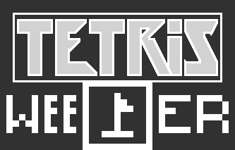

# Tetrisweeper

  Tetrisweeper - смесь тетриса и сапёра (Tetris + Mineswipper). Изначально всё выглядит, как тетрис. Здесь точно также нужно управлять падающими фигурами и пытаться запонить ими линии. Но после запонения линии она не удаляется.
  
  Для этого клетки нужно открывать точно так же, как в классическом сапёре: В каждой клетке может оказаться мина, если открыть клетку с ней - это поражение. Но если открыть клетку без мины, то в ней отобразится число - количество мин вокруг неё (0-8). Таким образом можно вычислять мины. На предполагаемое место мины можно поставить флажок.
                
  Если все клетки в линии, которые имеют мины, будут помечены флажками, а все клетки без мин открыты, линия удалится.
                
  Но есть ключевые правила, которые я решил добавить, чтобы игра была интереснее. Первое: клетки у границ блокируются, их открывать нельзя (визуально отображаются с крестом). Это сделано для того, чтобы нельзя было просто вычислить мину, когда фигура только приземлилась у открытой клетки.
                
  Второе правило, которое пришлось сделать - это исключение из первого. Ведь если накрыть пустое пространство клетками сверху, то его больше никак не заполнить, ведь клетки над этой "дыркой" заблокированы, а значит их невозможно открыть и удалить. Я назвал это "Hole problem". И второе правило эту проблему решает: все клетки над такими дырками можно открывать.
                
  Чем больше линий будет очищено, тем больше очков. Удачи!

  ## Управление:
[D | →] Сдвинуть вправо

[A | ←] Сдвинуть влево

[S | ↓] Сдвинуть вниз

[W | E | ↑] Повернуть вправо

[Q] Повернуть влево

[SPACE] Мгновенное падение (Hard drop)

[C] Поместить в Hold-ячейку

[ПКМ] Поставить/убрать флаг

[ЛКМ] Открыть клетку сапёра
