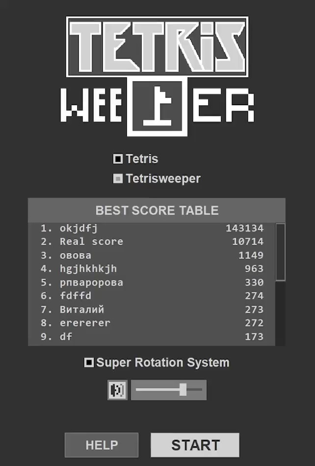
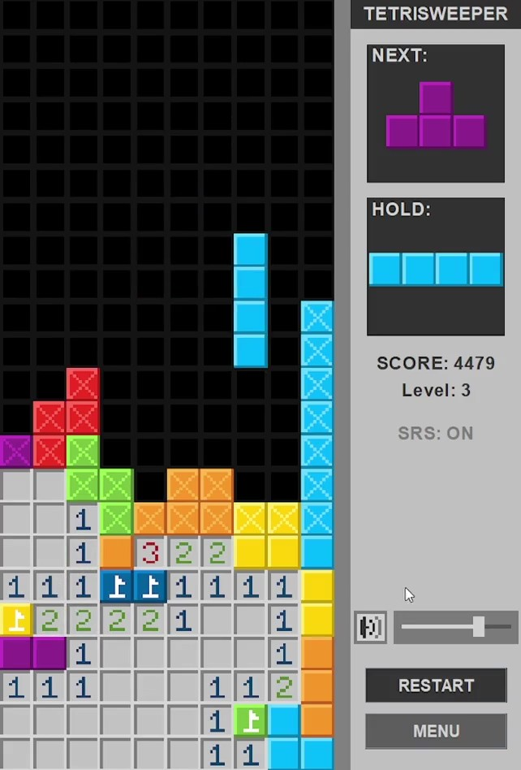

Это мой первый проект, не судите строго :)

        

[Небольшая нарезка геймплея](demonstrations/GameplayDemonstration.mp4)

[Полное видео геймплея](demonstrations/Gameplay.mp4)

[Вид меню](demonstrations/MenuDemonstration.mp4)

# Описание

Tetrisweeper - смесь Тетриса и Сапёра (Tetris + Minesweepper). Здесь точно так же, как и в Тетрисе нужно управлять падающими фигурами и пытаться запонить ими линии. Но в каждой клетке фигуры есть шанс оказаться мине, как в Сапёре. После запонения линий они не удаляются. Удалятся они только если открыть все клетки без мин, а на клетки с минами расставить флажки.

## Тетрис

Тетрис полноценно реализован, можно играть только в него, если выбрать в меню режим "Tetris". В том числе реализованы:
- Показ следующей фигуры.
- Ячейка "Hold". Позволяет поменять текущую фигуру с сохранённой в этой ячейке. Это можно сделать снова только после того, как фигура упадёт.
- Super Rotation System. Официальная система поворотов для случаев коллизий фигур. Можно отключить в главном меню. [Демонстрация Super Rotation System](demonstrations/SrsDemonstration.mp4).
- Каноничный счёт, за исключением бонусов и T-спинов.
- Каноничная скорость фигуры и ускорение с повышением уровня.

## Сапёр

Клетки открываются как в классическом Сапёре: В каждой клетке может оказаться мина, если открыть клетку с ней - это поражение. Но если открыть клетку без мины, то в ней отобразится число - количество мин вокруг неё (0-8). Таким образом можно вычислять мины. На предполагаемое место мины можно поставить флажок.

## Тетрис-спёр

Тетрис-сапёр совмещает в себе всё из Тетриса м Сапёра, но есть оговорки и дополничельные правила.

1. Линия удаляется только если все клетки в линии, которые имеют мины, помечены флажками, а все клетки без мин открыты.
2. Клетки у границ блокируются, их открывать нельзя (визуально отображаются с крестом). Это сделано для того, чтобы нельзя было просто вычислить мину, когда фигура только приземлилась у открытой клетки. Флаги на заблокированные клетки ставить не запрещено.
3. Если накрыть пустое пространство клетками сверху, то его больше никак не заполнить, ведь клетки над этой "дыркой" заблокированы, а значит их невозможно открыть и удалить. Я назвал это "Hole problem". Правило, которое эту проблему решает: клетки над такими дырками можно открывать. [Демонстрация Hole problem](demonstrations/HoleProblemDemonstration.mp4).

Помимо ключевых правил, есть ещё небольшие особенности:
- Начисление очков берётся от Тетриса, но слегка изменено для очков за удаление линий: кол-во очков стабильно = 200*(число удалённых линий).
- В обоих случаях будет поражение: от взрыва Сапёра или от выхода за поле Тетриса.
- Скорость падения фигур замедленна в 1,5 раза.
- Высота поля увеличена на 3 клетки по сравнению с оригинальным.

# Управление
| Клавиши | Описание |
|-|-|
|D, →| Сдвинуть вправо |
|A, ←| Сдвинуть влево |
|S, ↓| Сдвинуть вниз |
|W, E, ↑| Повернуть вправо |
|Q| Повернуть влево |
|SPACE| Мгновенное падение (Hard drop) |
|C| Поместить в Hold-ячейку |
|ПКМ| Поставить/убрать флаг |
|ЛКМ| Открыть клетку сапёра |
|ESC| Пауза |

# Тактика и советы
В отливие от обычного Тетриса, Тетрис-сапёр больше на "поразмышлять", чем на ловкость, торопиться здесь не нужно. Если в Тетрисе дырку легко исправить, то здесь на это требуется больше усилий и везения, хоть в целом это и возможно.

Во время игры нужно вдумчиво контролировать, куда падают фигуры, чтобы не допускать дырки и продолжать в нужных местах поле Сапёра. Для этого очень помогает Hold-ячейка.

Помимо контроля падения фигур нужно ешё и решать поле Сапёра. Лучше рисковать по минимуму и не открывать клетки наудачу. Хотя иногда это приходится делать. По моему опыту проигрыши в основном происходят от мин.
